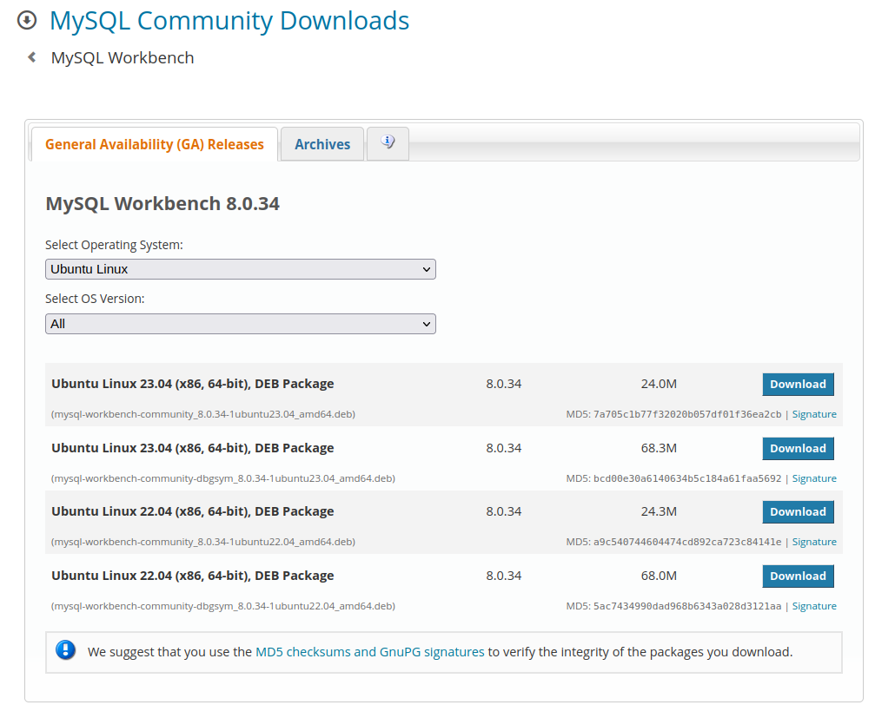

# Docker Compose

### Construir imagenes

```sh
docker compose build
```

### Levantar contenedores

```sh
docker compose up -d
```

NOTA: Si aun no se han construido las imaganes se puede agregar el comando --build al final para que las contruya y luego levante los contenedores.

### Detener contenedores

```sh
docker compose down
```

### Si el archivo .yml no se llama "docker-compose" utilizaremos los siguientes comandos.

```sh
docker-compose -f <nombre_archivo.yml> up -d
docker-compose -f <nombre_archivo.yml> down
```

# Docker Volumenes

### Listar los Volumenes.
```sh
docker volume ls
```

### Crear un Volumen.

```sh
docker volume create <nombre_del_volumen>
```

### Eliminar un volumen.

```sh
docker volume rm <nombre_del_volumen>
```

### Eliminar todos los volúmenes no utilizados.

```sh
docker volume prune
```


# MYSQL

### ¿Como Descargar la imagen de MySQL?

utilizaremos el siguiente comando para descargar la imagen de MYSQL.

```sh
docker pull mysql
```

### Referencia: [MYSQL](https://hub.docker.com/_/mysql)


## Levantar el contenedor

```sh 
docker run --name <nombre_contenedor> -d -p 3306:3306 -e MYSQL_ROOT_PASSWORD=<mi_password> <nombre_imagen>
```

Ejemplo: 
```sh
docker run --name mysql-db -d -p 3306:3306 -e MYSQL_ROOT_PASSWORD=secret mysql
```
docker run --name mysql-db -d -p 3306:3306 -e MYSQL_ROOT_PASSWORD=mysql123 mysql

## Acceder al contenedor
```sh
docker exec -it <nombre_contendor> mysql -uroot -p<mi_password>
```

Ejemplo:
```sh
docker exec -it mysql-db mysql -uroot -psecret
```

Aquí podrán utilizar la sintaxis de MySQL
```sh
CREATE DATABASE <mi_base>;

USE DATABASE <mi_base>;
```

### Con Persistencia

```sh 
docker run -dp 3306:3306 --name <nombre_contendor>  -e MYSQL_ROOT_PASSWORD=<mi_password> --mount src=<volumen>,dst=/var/lib/mysql mysql
```

Ejemplo:
```sh
docker run -d -p 3306:3306 --name mysql-db  -e MYSQL_ROOT_PASSWORD=secret --mount src=mysql-data,dst=/var/lib/mysql mysql
```


# Workbench

### Instalar Workbench en  Ubuntu 22.04

### Paso 1: Descargar la Version que Deseamos en [Workbench](https://dev.mysql.com/downloads/workbench/)



en este caso descargamos la version Ubuntu Linux 22.04 de 24.3M

### Paso 2: Nos ubicamos en la carpeta que se encuentra el .deb y abrimos una terminal y ejecutamos el siguiente comando.

```sh
sudo dpkg -i <nombre_del_archivo>.deb
```

ejemplo: 

```sh
jhonathan@jhonathan-HP-Laptop-14-cf2xxx:~/Descargas$ sudo dpkg -i mysql-workbench-community_8.0.34-1ubuntu22.04_amd64.deb
```

Nota: La terminal tiene que estar en la ruta Descargas, ya que aqui es donde se encuentra el archivo .deb

### Paso Extra: Si al terminar el proceso anterior existen algunos errores en la instalacion por dependencias, puede solucionarse de estamanera.

```sh
sudo apt --fix-broken install
```

### Instalar DBeaver en  Ubuntu 22.04

```sh
sudo snap install dbeaver-ce
```

### [Grabacion_Clase3](https://drive.google.com/file/d/1n8Jzq7zNTdEIWR6WZB3w3zheYIgQaWqM/view?usp=sharing)