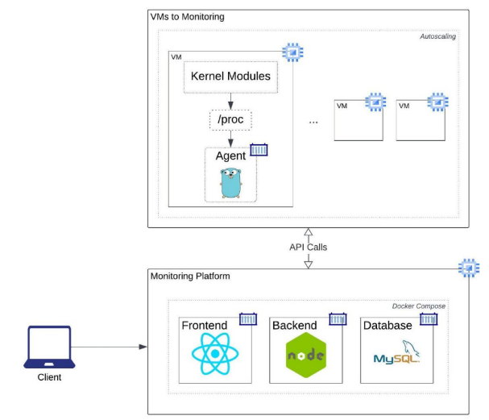

# Guia Proyecto

## Paso 1

* Construir los Modulos de Kernel
* Realizar Pruebas locales:
    * Insertar y Eliminar los modulos **(Insmod y Rmmod)**
    * verificar el contenido de los modulos en la direccion **/proc** con el comando cat **<nombre_modulo>**
* Se recomienda que se la informacion se envie como formato json para un mejor manejo.

## Paso 2
Desarrolla el Agente en Golang para la lectura de tus Modulos

## Paso 3
Realiza Tu Modelo Relacional y crea tu DB en **Mysql** y levanta tu contenedor.

## Paso 4
Crea Tu Backend en NodeJS. intenta comunicarlo con el agente y luego de la Base de Datos.

## Paso 5
Realiza Tu Frontend, con una muestra de datos.

