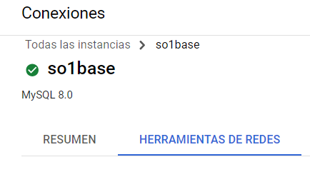

# Guia Proyecto 2

## 1. Crear la Instancia de Cloud SQL
Abrimos nuestra cuenta de GCP

- Seleccionamos la Opcion de SQL

- Seleccionamos Crear Instancia

- Apareceran 3 opciones y seleccionaremos MYSQL

- Realizamos la siguiente configuracion

colocamos el nombre y contraseña

seleccionamos la version enterprise para reducir costos.

Cambiamos la Region y Creamos la instancia.

- Cuando se Genere la instancia visualizaremos la direccion ip publica.

- Para poder conectarnos debemos de Agregar nuestra ip publica para poder darle acceso.

para conocer nuestra ip publica podemos acceder a la siguiente pagina: https://www.ionos.es/tools/direccion-ip

Ahora debemos agregarlo a CLOUD SQL y nos vamos a la opcion Conexiones

seleccionamos la pestaña de Herramientas de redes

y agregamos una nueva red, asignandole un nombre y colocando nuestra ip publica.

Seleccionamos Listo y debemos Guardar los cambios.

- Ahora Nos Conectamos con Workbench o DBeaver

en Host colocamos la ip publica de nuestra instancia y luego agregamos las demas credenciales (usuario y contraseña)

- Probamos la conexion y listo.

